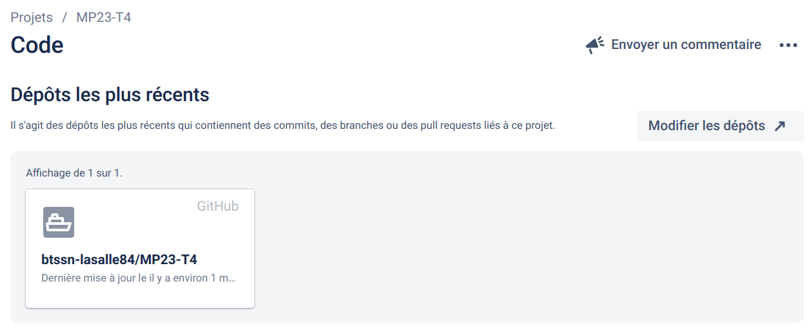
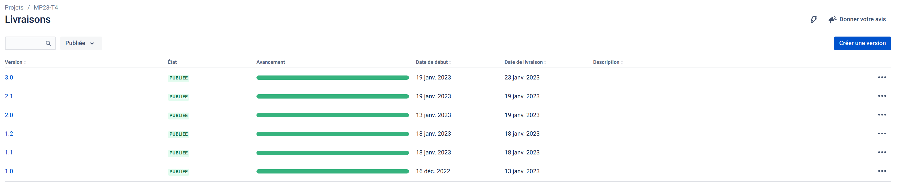
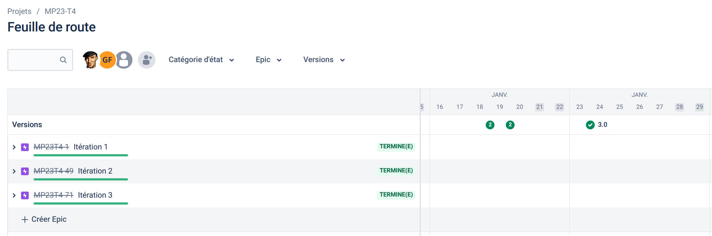
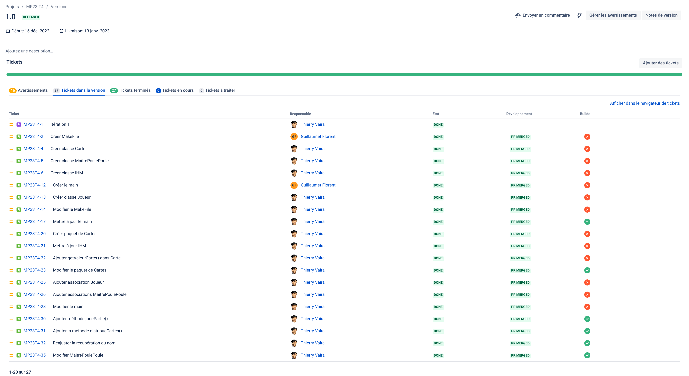
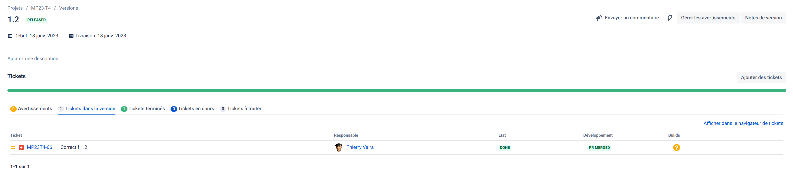
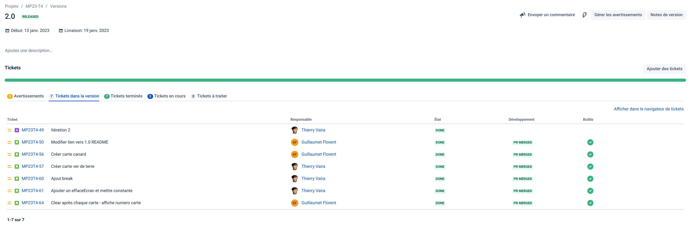
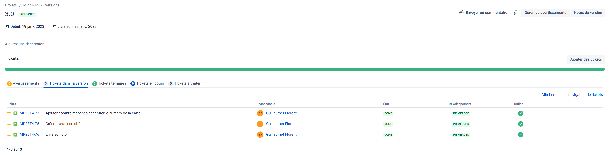

 

# Mini-projet : Poule-Poule

## Présentation

C’est le Festival de Cannes et l’avant-première du film Poule Poule est en train de virer au drame.
En effet, un peu moins d’une heure avant la projection, ce maladroit de Waf a mélangé l’ensemble des pellicules !
Pour aider Cocotte, qui n’a pas une minute à perdre, et pour éviter que Crack ne craque pour
de bon, il faut reconstituer le film au plus vite !

---

> Ceci est un mini-projet de 2 étudiants de BTS SN option Informatique & Réseaux développé en C++. L'objectif était la mise en oeuvre d'une méthode agile [Kanban](https://fr.wikipedia.org/wiki/Kanban_(d%C3%A9veloppement)) avec les outils **Jira / Github** et en appliquant le _workflow_ [Gitflow](https://btssn-lasalle84.github.io/guides-developpement-logiciel/jira.html#ancre-gitflow). L'application devait être limitée à une interface en ligne de commande (console).

---

## Auteurs

- Guillaumet Florent (<florent.guillaumet.pro@gmail.com>)
- Cochet Baptiste (<cochet.baptiste.pro@gmail.com>)

## Jira

Intégration avec Github :

### Historique des versions

- [Version 1.0](https://github.com/btssn-lasalle84/MP23-T4/releases/tag/1.0) : 12/01/2023
- [Version 1.1](https://github.com/btssn-lasalle84/MP23-T4/releases/tag/1.1) : 18/01/2023
- [Version 1.2](https://github.com/btssn-lasalle84/MP23-T4/releases/tag/1.2) : 18/01/2023
- [Version 2.0](https://github.com/btssn-lasalle84/MP23-T4/releases/tag/2.0) : 19/01/2023
- [Version 2.1](https://github.com/btssn-lasalle84/MP23-T4/releases/tag/2.1) : 19/01/2023
- [Version 3.0](https://github.com/btssn-lasalle84/MP23-T4/releases/tag/3.0) : 23/01/2023

### Feuille de route

### Tickets

#### Version 1.0

#### Version 1.2

#### Version 2.0

#### Version 3.0

## Recette

|Fonctionnalités 1.0|oui|non|
|---|:-:|---|
|Saisir le nom du joueur|✅|
|Créer un paquet de carte et le mélanger|✅|
|Jouer une manche simple|✅|
|Afficher le déroulement d'une manche|✅|

|Fonctionnalités 2.0|oui|non|
|---|:-:|---|
|Jouer une partie composée de plusieurs manches|| :negative_squared_cross_mark:|
|Afficher le déroulement d'une partie|✅|
|Intégré de nouveaux acteurs|✅|

Fonctionnalités 2.1|oui|non|
|---|:-:|---|
|Jouer une partie composée de plusieurs manches|✅|
|Afficher le déroulement d'une partie|✅|
|Intégré de nouveaux acteurs|✅|

Fonctionnalités 3.0|oui|non|
|---|:-:|---|
|Choisir un niveau de difficulté (durée d’affichage des cartes)|✅|
|Intégré d'autres acteurs|✅|

## Ressources logicielles

|Désignation|Caractéristiques|
|---|---|
|OS Poste de développement|PC sous GNU/Linux Ubuntu 20.04|
|Langage utilisé|C++|

---
©️ BTS SNIR LaSalle Avignon 2023
